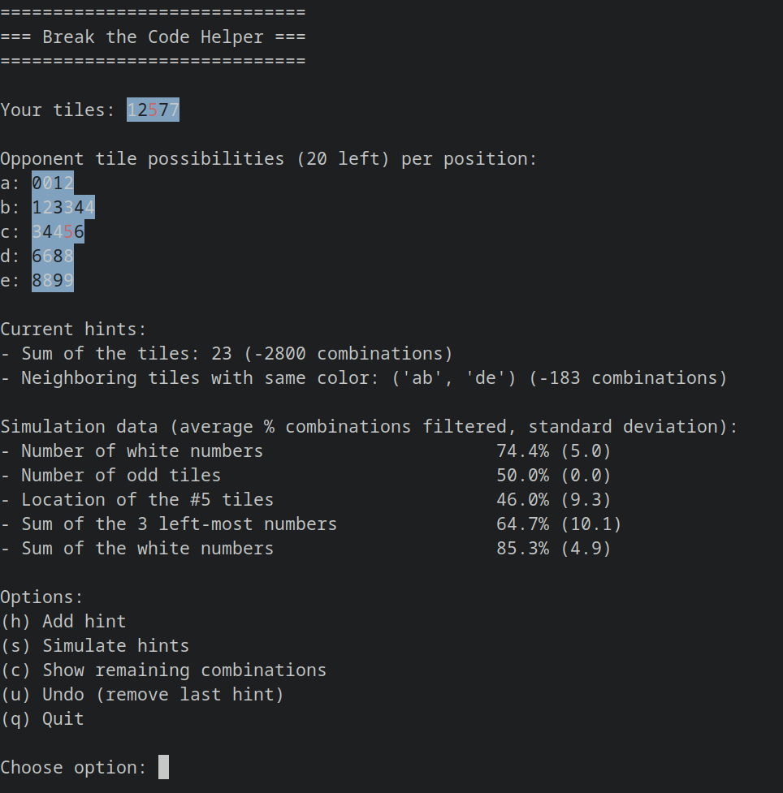

# Break the Code Helper

This program is an interactive helper for the 2-player version of the game [Break the Code](https://boardgamegeek.com/boardgame/227466/break-code) that can be played online on [Board Game Arena](https://boardgamearena.com/gamepanel?game=breakthecode).

## Features

- Keeps track of your hints.
- As the game moves on, automatically updates a board that tells you which tile can possibly be found in which position in the opponent's hand.
- Shows you all possible remaining combinations for the opponent's tiles.
- A simulator allows you to estimate the best hint to choose from the available hints.

## Tips

- You can improve the simulator accuracy by increasing the value of variable `SIMULATION_ITERATIONS` in file `utils.py` (but computing the results will take more time).
- Learn the hint shortcuts!

## Screenshot

